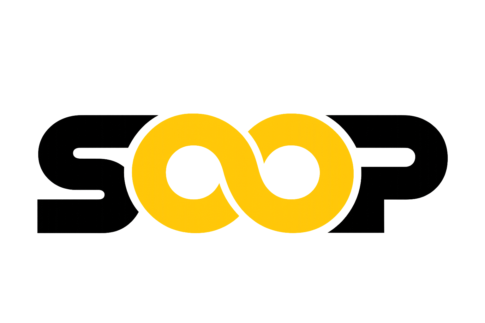

<p align="center">
  <picture>
    <source media="(prefers-color-scheme: dark)" srcset="public/logo/weblogo-white.png">
    <source media="(prefers-color-scheme: light)" srcset="public/logo/weblogo-black.png">
    
  </picture>
</p>

<h1 align="center">Veera Satwik Sai — Portfolio</h1>

<p align="center">
  <strong>A premium, high-performance interactive portfolio built using Next.js 16, React 19, and advanced WebGL/3D graphics.</strong>
</p>

---

## 🚀 Key Features

* **Advanced 3D WebGL Elements** — Implemented using **Three.js** and **React Three Fiber (R3F)** for immersive interactive elements.
* **Liquid Animations & Micro-interactions** — Built with **GSAP**, **Framer Motion**, and **Anime.js** for smooth, studio-grade transitions.
* **Integrated AI Chatbot Assistant** — Powered by the **Gemini / Anthropic / OpenAI APIs** to answer client inquiries about technical skills, education, and experience.
* **Administrative Control Panel** — Secure dashboard to update portfolio projects, timeline items, services, skills, and check client messages/inquiries.
* **Ultra-smooth Scrolling** — Powered by **Lenis Scroll** for premium feel and high-performance inertia scroll.
* **Perfect SEO & Schema Markups** — Automatically structured JSON-LD schemas (Person, WebSite, ProfilePage) for professional search rankings.

---

## 🛠️ Tech Stack

| Component | Technology |
| :--- | :--- |
| **Framework** | Next.js 16.2.6 (Turbopack / Webpack) |
| **Core Library** | React 19.0.0 |
| **Styling** | Tailwind CSS 4.0 |
| **3D Engine** | Three.js & React Three Fiber |
| **Animations** | GSAP, Framer Motion, Anime.js |
| **Scroller** | Lenis Scroll |
| **Database/Storage** | Local structured JSON storage with API endpoints |
| **Icons** | Lucide React |

---

## 🎯 Getting Started

### Prerequisites

Ensure you have **Node.js (v18.0.0 or higher)** and **npm** installed.

### Installation

1. **Clone the repository:**
   ```bash
   git clone https://github.com/Satwiksai36/My-Portfolio.git
   cd My-Portfolio
   ```

2. **Install dependencies:**
   ```bash
   npm install
   ```

3. **Set up Environment Variables:**
   Create a `.env.local` file in the root directory and add your keys for the AI chatbot (optional):
   ```env
   # Add one or more keys to enable the AI assistant:
   GEMINI_API_KEY=your_gemini_api_key
   ANTHROPIC_API_KEY=your_anthropic_api_key
   OPENAI_API_KEY=your_openai_api_key

   # Set admin panel password (defaults to "admin" if omitted):
   ADMIN_PASSWORD=your_admin_password
   ```

4. **Run the development server:**
   ```bash
   npm run dev
   ```
   Open [http://localhost:3000](http://localhost:3000) in your browser.

---

## 📁 Project Structure

```text
├── src/
│   ├── app/                # Next.js App Router (pages, API routes, layout)
│   │   ├── admin/          # Administrative panel interface
│   │   ├── api/            # API endpoints (auth, upload, chat, contact)
│   │   └── layout.tsx      # Global layouts, SEO tags, & Schema markups
│   ├── components/         # Reusable interactive React components
│   └── lib/                # Contexts, themes, helper hooks, and JSON data
├── public/                 # Static assets, local logos, and media uploads
├── tsconfig.json           # TypeScript configuration
└── tailwind.config.ts      # Tailwind CSS layout configs
```

---

## 🚀 Deployment

The project is fully optimized for **Vercel**:
1. Push your updated code to your GitHub repository.
2. Import the repository in your Vercel Dashboard.
3. Configure the Environment Variables in Vercel settings if needed.
4. Click **Deploy**!

---

## 👨‍💻 Author

- **Veera Satwik Sai**
- **GitHub:** [@Satwiksai36](https://github.com/Satwiksai36)
- **LinkedIn:** [Veera Satwik Sai](https://www.linkedin.com/in/satwiksaiveera/)
- **Email:** satwiksai36@gmail.com
